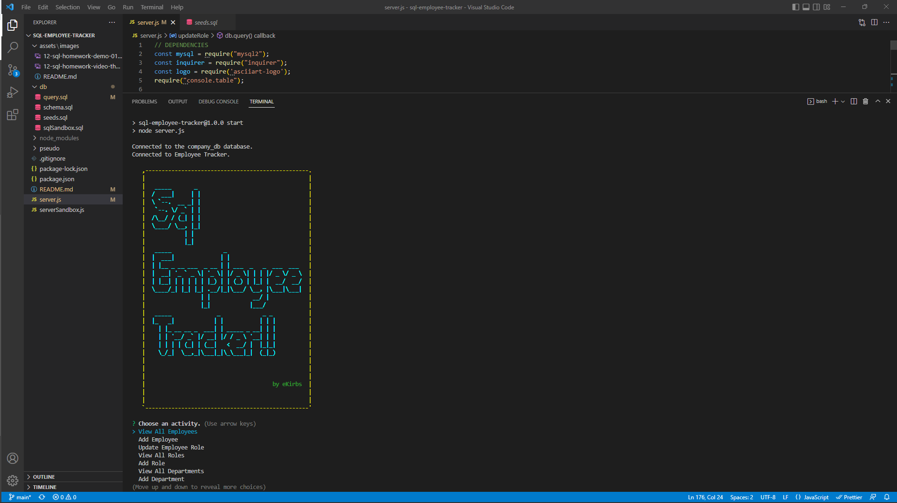

# SQL EMPLOYEE TRACKER

## Description

This is an app that provides an easy-to-navigate interface in the terminal that allows the user to access and manipulate a database of employee information for a company. This database, named company_db for clarity's sake, is comprised of three tables:  employee, role, and deparment.  The purpose of this project was to gain an understanding of database creation and manipulation using MySQL, and to get more experience using inquirer.  The SQL queries proved to be a challenge, but database management on a whole was an extremely interesting and engaging topic.

Link: [MySQL Employee Tracker](https://github.com/ekirbs/sql-employee-tracker 'An app that provides an interface to access and manipulate an employee database.')

## Table of Contents

- [Installation](#installation)
- [Usage](#usage)
- [Credits](#credits)
- [License](#license)

## Installation

Requires the use of Node Package Manager.

* Uses the [Inquirer package](https://www.npmjs.com/package/inquirer/v/8.2.4).

* Uses the [MySQL2 package](https://www.npmjs.com/package/mysql2) to connect to a MySQL database.

* Uses the [console.table package](https://www.npmjs.com/package/console.table) to print MySQL rows to the console.

* Uses the [asciiart-logo package](https://www.npmjs.com/package/asciiart-logo) to display an ASCII Art digital logo.

## Usage

Once all the required dependencies are installed, start the program by entering "node server" or "npm start" in the terminal.  The title logo will render and a main menu will appear.  Use the up and down arrows to navigate through the menu.  Press enter to choose the option you want.  If you choose to VIEW something, a table will appear with the desired information.  If you choose to ADD something, you will be prompted to enter information into the fields.  Once done, the information will be added to the database.  Enjoy!

## Credits

Special thanks to the Web Dev Simplified Youtube channel!
 
Link: [Web Dev Simplified](https://www.youtube.com/@WebDevSimplified 'The Youtube channel for Web Dev Simplified.')

## License

N/A
